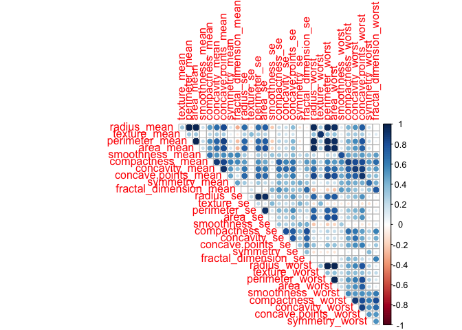
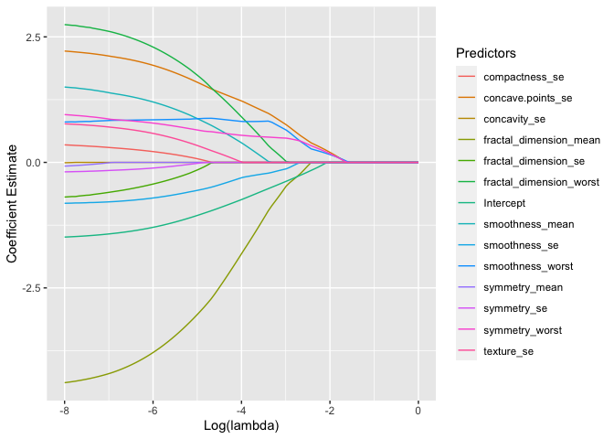
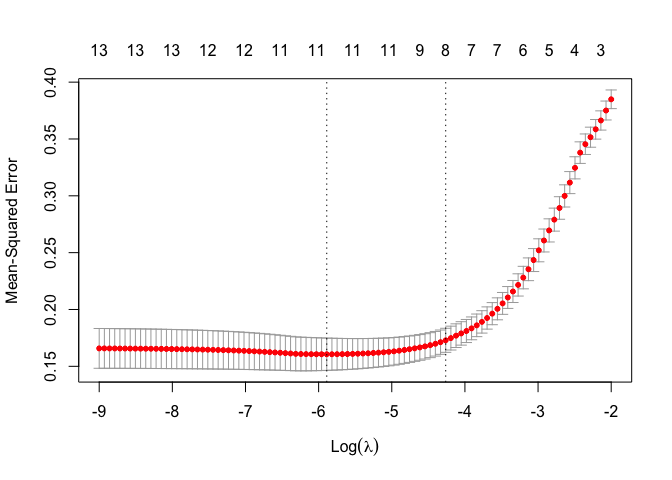
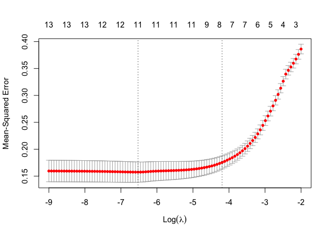

Logistic-LASSO Breast Cancer Classification Task
================
Ngoc Duong - nqd2000
3/25/2020

Data import and cleaning

``` r
breast_cancer_data = read.csv("./breast-cancer-1.csv")

bcdf = breast_cancer_data %>% 
  mutate(diagnosis = ifelse(diagnosis == "M",1,0)) %>% 
  dplyr::select(diagnosis, everything()) %>% 
  dplyr::select(-id, -X)
```

Standardize design matrix (because although logistic is scale-invariant,
LASSO is not, this is to ensure comparability of estimates by these
different
models)

``` r
pred_names = bcdf %>% dplyr::select(-diagnosis) %>% names() %>% as.vector()
bcdf_x = NULL

for (i in pred_names) {
col = (bcdf[,i] - mean(bcdf[,i]))/sd(bcdf[,i])
bcdf_x = cbind(bcdf_x , col)
}

colnames(bcdf_x) <- c(pred_names)

bcdf_fin = cbind(bcdf[1], bcdf_x)
```

Try to git a logistic regression model using glm package. The warning
messages show algorithm did not converge, potentially due to
multicollinearity.

``` r
log.mod = glm(diagnosis~., data = bcdf_fin, family = "binomial")
```

    ## Warning: glm.fit: algorithm did not converge

    ## Warning: glm.fit: fitted probabilities numerically 0 or 1 occurred

``` r
summary(log.mod)
```

    ## 
    ## Call:
    ## glm(formula = diagnosis ~ ., family = "binomial", data = bcdf_fin)
    ## 
    ## Deviance Residuals: 
    ##    Min      1Q  Median      3Q     Max  
    ##  -8.49   -8.49   -8.49    8.49    8.49  
    ## 
    ## Coefficients:
    ##                          Estimate Std. Error z value Pr(>|z|)    
    ## (Intercept)                253916      23548  10.783  < 2e-16 ***
    ## radius_mean               8552881     948876   9.014  < 2e-16 ***
    ## texture_mean               842067      63252  13.313  < 2e-16 ***
    ## perimeter_mean           35796847     598698  59.791  < 2e-16 ***
    ## area_mean               -45790271    1375034 -33.301  < 2e-16 ***
    ## smoothness_mean          -2144100     117586 -18.234  < 2e-16 ***
    ## compactness_mean          -339500     169667  -2.001  0.04540 *  
    ## concavity_mean              83032     112278   0.740  0.45959    
    ## concave.points_mean       -665733     208830  -3.188  0.00143 ** 
    ## symmetry_mean             1109889      21306  52.093  < 2e-16 ***
    ## fractal_dimension_mean    -298858      15312 -19.519  < 2e-16 ***
    ## radius_se                 9230274     324119  28.478  < 2e-16 ***
    ## texture_se                3513102     110604  31.763  < 2e-16 ***
    ## perimeter_se              3438590      95432  36.032  < 2e-16 ***
    ## area_se                 -29084420     834804 -34.840  < 2e-16 ***
    ## smoothness_se             2249396      36747  61.213  < 2e-16 ***
    ## compactness_se           -3175247     102656 -30.931  < 2e-16 ***
    ## concavity_se              4614370     161208  28.624  < 2e-16 ***
    ## concave.points_se        -7773633     247582 -31.398  < 2e-16 ***
    ## symmetry_se               2389064      34103  70.054  < 2e-16 ***
    ## fractal_dimension_se      4001120     174560  22.921  < 2e-16 ***
    ## radius_worst            -29628795    1035752 -28.606  < 2e-16 ***
    ## texture_worst            -3584767     149772 -23.935  < 2e-16 ***
    ## perimeter_worst         -11889227     409644 -29.023  < 2e-16 ***
    ## area_worst               50959831    1560436  32.657  < 2e-16 ***
    ## smoothness_worst          -493436      75304  -6.553 5.66e-11 ***
    ## compactness_worst         1413874      62922  22.470  < 2e-16 ***
    ## concavity_worst          -6316972     317828 -19.875  < 2e-16 ***
    ## concave.points_worst      9408268     359616  26.162  < 2e-16 ***
    ## symmetry_worst           -1530342      20986 -72.923  < 2e-16 ***
    ## fractal_dimension_worst   -667962      96441  -6.926 4.33e-12 ***
    ## ---
    ## Signif. codes:  0 '***' 0.001 '**' 0.01 '*' 0.05 '.' 0.1 ' ' 1
    ## 
    ## (Dispersion parameter for binomial family taken to be 1)
    ## 
    ##     Null deviance:   751.44  on 568  degrees of freedom
    ## Residual deviance: 32006.76  on 538  degrees of freedom
    ## AIC: 32069
    ## 
    ## Number of Fisher Scoring iterations: 25

Investigate multicollinearity
problem

``` r
bcdf_fin %>% dplyr::select(-diagnosis) %>%  #filter only numeric variables
  cor() %>%   
  #compute correlation matrix
  corrplot(method = "circle",         #represent correlation in "circle", size = magnitude 
           type = "upper", 
           diag=FALSE
           )
```

<!-- -->

``` r
#We can see that there are some very strong correlations between certain variables
```

Find correlation pairs that are above 0.6 to leave out of the
dataset

``` r
#obtain list of variables that are correlated with one another whose correlation is at least 0.85
cor_var = bcdf_x %>% 
    correlate() %>% 
    stretch() %>% 
    arrange(desc(r)) %>% 
    filter(r > 0.85) %>% 
    slice(which(row_number() %% 2 == 0)) %>% 
    pivot_longer(x:y) %>% dplyr::select(-r,-name) %>% distinct(value) 
```

    ## 
    ## Correlation method: 'pearson'
    ## Missing treated using: 'pairwise.complete.obs'

``` r
#full data with response variable and predictors
full_data = as_tibble(bcdf_fin) %>% dplyr::select(-perimeter_mean, -radius_mean, -perimeter_worst, -radius_worst, -area_mean, -area_worst, -perimeter_se, -radius_se, -area_se, -concave.points_mean, -concavity_mean, -texture_worst, -texture_mean, -compactness_worst, -concave.points_worst, -concavity_worst,-compactness_mean) 

#design matrix without intercept
Xmat_no_int = full_data %>% dplyr::select(-diagnosis) 

#design matrix with intercept
Xmat_int = Xmat_no_int %>% mutate(intercept = 1)
```

Looking at logistic regression results by glm

``` r
log.mod = glm(diagnosis~., data = full_data, family = "binomial")
summary(log.mod)
```

    ## 
    ## Call:
    ## glm(formula = diagnosis ~ ., family = "binomial", data = full_data)
    ## 
    ## Deviance Residuals: 
    ##      Min        1Q    Median        3Q       Max  
    ## -3.12112  -0.28937  -0.05735   0.19911   2.55257  
    ## 
    ## Coefficients:
    ##                         Estimate Std. Error z value Pr(>|z|)    
    ## (Intercept)             -1.52775    0.20654  -7.397 1.39e-13 ***
    ## smoothness_mean          1.57247    0.40552   3.878 0.000105 ***
    ## symmetry_mean           -0.11873    0.30203  -0.393 0.694245    
    ## fractal_dimension_mean  -4.50615    0.53498  -8.423  < 2e-16 ***
    ## texture_se               0.80683    0.23051   3.500 0.000465 ***
    ## smoothness_se           -0.83043    0.29501  -2.815 0.004880 ** 
    ## compactness_se           0.39537    0.42498   0.930 0.352201    
    ## concavity_se            -0.02998    0.34701  -0.086 0.931160    
    ## concave.points_se        2.28564    0.36494   6.263 3.78e-10 ***
    ## symmetry_se             -0.20394    0.33909  -0.601 0.547557    
    ## fractal_dimension_se    -0.75510    0.55886  -1.351 0.176651    
    ## smoothness_worst         0.78588    0.48781   1.611 0.107174    
    ## symmetry_worst           1.00913    0.43083   2.342 0.019166 *  
    ## fractal_dimension_worst  2.83456    0.64071   4.424 9.68e-06 ***
    ## ---
    ## Signif. codes:  0 '***' 0.001 '**' 0.01 '*' 0.05 '.' 0.1 ' ' 1
    ## 
    ## (Dispersion parameter for binomial family taken to be 1)
    ## 
    ##     Null deviance: 751.44  on 568  degrees of freedom
    ## Residual deviance: 264.20  on 555  degrees of freedom
    ## AIC: 292.2
    ## 
    ## Number of Fisher Scoring iterations: 7

### Task 1

Build a logistic model to classify the images into malignant/benign, and
write down your likelihood function, its gradient and Hessian
matrix.

``` r
# Function to compute the loglikelihood, the gradient, and the Hessian matrix for data dat evaluated at the parameter value betavec
## dat    - A list with components
#  x      - vector of explanatory variables
#  y      - vector of corresponding (binary) response variables
# betavec - [beta_0, beta_1, ..., beta_n] - the vector of parameter
#             values at which to evaluate these quantities

## Returns a list with the following components evaluated at beta
#  loglik - (scalar) the log likelihood
#  grad   - (vector of length 2) gradient
#  Hess   - (2 x 2 matrix) Hessian#
```

Function to return log-likelihood, gradient, and Hessian matrix of
logistic regression

``` r
logisticstuff <- function(y, x, betavec) {
  u <- x %*% betavec
  expu <- exp(u)
  loglik.ind = NULL
  #for(i in 1:length(y)) {
    #loglik.ind[i] = y[i]*u[i] - log(1+ expu)
    #}
  #loglik = sum(loglik.ind)
  loglik = t(u) %*% y - sum((log(1+expu)))
  # Log-likelihood at betavec
  
  p <- expu / (1 + expu)
  # P(Y_i=1|x_i)
  
  #grad = NULL
  #for(i in 1:length(betavec)){
    #grad[i] = sum(t(x[,i])%*%(dat$y - p))
  #}
  grad = t(x) %*% (y-p)
   #gradient at betavec
  
    # Hessian at betavec
  hess <- -t(x) %*% diag(as.vector(p*(1-p))) %*% x
  return(list(loglik = loglik, grad = grad, Hess = hess))
}
```

Newton-Raphson with gradient ascent and step-halving

``` r
NewtonRaphson <- function(y, x, func, start, tol=1e-10, maxiter = 200) {
  i <- 0
  cur <- start
  x = as.matrix(x)
  colnames(x) = names(bcdf_x)
  stuff <- func(y, x , cur)
  res <- c(0, stuff$loglik, cur)
  prevloglik <- -Inf
  while(i < maxiter && abs(stuff$loglik - prevloglik) > tol) {
    i <- i + 1
    prevloglik <- stuff$loglik
    prev <- cur
    grad <- stuff$grad
    hess <- stuff$Hess
    
    #gradient descent 
    if(t(grad) %*% hess %*% grad > 0){#positive definite matrix
    inv.hess = 
      solve(hess - (max(diag(hess))+100)*diag(nrow(hess)))} #make positive definite matrix negative definite
    else 
    {inv.hess <- solve(hess)}
    
    cur <- prev - inv.hess%*%grad
    stuff <- func(y, x, cur)
    
    #step-halving
    step = 0
    while (prevloglik > stuff$loglik){#moving too far -> halve step
    step = step + 1 
    cur <- prev - (1/2)^step * inv.hess%*%grad
    stuff <- func(y, x, cur)
    }
  res <- rbind(res, c(i, stuff$loglik, cur))
  }
  return(res)
  }
```

Test on
dataset

``` r
newton_raph_res = NewtonRaphson(y = full_data$diagnosis, as.matrix(Xmat_int), logisticstuff, start = rep(0, ncol(Xmat_int)))

#convert to data frame 
newton_raph_coeff = newton_raph_res[c(nrow(newton_raph_res)),3:ncol(newton_raph_res)] %>% t() %>% as.data.frame()

#assign names to coeffcieints
colnames(newton_raph_coeff) = colnames(Xmat_int)

#obtain final coeffcients
as_tibble(newton_raph_coeff)
```

    ## # A tibble: 1 x 14
    ##   smoothness_mean symmetry_mean fractal_dimensi… texture_se smoothness_se
    ##             <dbl>         <dbl>            <dbl>      <dbl>         <dbl>
    ## 1            1.57        -0.119            -4.51      0.807        -0.830
    ## # … with 9 more variables: compactness_se <dbl>, concavity_se <dbl>,
    ## #   concave.points_se <dbl>, symmetry_se <dbl>, fractal_dimension_se <dbl>,
    ## #   smoothness_worst <dbl>, symmetry_worst <dbl>,
    ## #   fractal_dimension_worst <dbl>, intercept <dbl>

Logistic-LASSO

Coordinate-wise descent LASSO

``` r
soft_threshold = function(beta, lambda) {
  ifelse(abs(beta)>lambda && beta > 0,
         beta-lambda, 
         ifelse(abs(beta) > lambda && beta < 0, 
                beta + lambda,
                0))}

#soft_threshold = function(beta, lambda) {sign(beta)*ifelse(abs(beta)>lambda, abs(beta)-lambda,0)}

coord.lasso = function(lambda, y, X, betavec, tol = 1e-7, maxiter = 200){
  i = 0
  X = as.matrix(X)
  loglik = 1e6 
  res = c(0, loglik, betavec)
  prevloglik = Inf
  while (i < maxiter && abs(loglik - prevloglik) > tol && loglik < Inf){
    i = i + 1
    prevloglik = loglik
    for (k in 1:length(betavec)){
      u = X %*% betavec 
      expu = exp(u)
      p = expu/(1 + expu)
      weight = p*(1-p)
      
      #avoid coefficients from divergence to achieve final fitted probabilities of 0 or 1
      weight = ifelse(abs(weight-0) < 1e-7, 1e-7, weight)
      
      #calculate working responses 
      resp = u + (y-p)/weight
      #r = z - X%*%betavec
      resp_without_j = X[,-k] %*% betavec[-k]
      
      #soft-threshold solution
      betavec[k] = soft_threshold(mean(weight*X[,k]*(resp-resp_without_j)),lambda)/(mean(weight*(X[,k]^2)))}
    
    #calculate new log-likelihood
  loglik = 1/(2*nrow(X))*sum(weight*(resp-X%*%betavec)^2) + lambda*sum(abs(betavec))
  res = rbind(res, c(i, loglik, betavec))
  }
  return(res)
}
```

``` r
coord.lasso(lambda = 0.3, 
            y = full_data$diagnosis, 
            X = as.matrix(Xmat_int), 
            betavec = rep(1, ncol(Xmat_int)))
```

    ##     [,1]         [,2] [,3] [,4] [,5] [,6] [,7] [,8] [,9] [,10] [,11] [,12]
    ## res    0 1.000000e+06    1    1    1    1    1    1    1     1     1     1
    ##        1 6.611112e-01    0    0    0    0    0    0    0     0     0     0
    ##        2 5.000000e-01    0    0    0    0    0    0    0     0     0     0
    ##        3 5.000000e-01    0    0    0    0    0    0    0     0     0     0
    ##     [,13] [,14] [,15] [,16]
    ## res     1     1     1     1
    ##         0     0     0     0
    ##         0     0     0     0
    ##         0     0     0     0

### Check for convergence

Compute the solution on a grid of lambdas. Pathwise coordinate
optimization to get PATH OF SOLUTIONS

``` r
path = function(X, y, tunegrid){
  coeff = NULL
  tunegrid = as.vector(tunegrid)
  for (nl in tunegrid){
    coord_res = coord.lasso(lambda = nl,
                            X = as.matrix(X), 
                            y = y,
                            betavec = rep(1, ncol(X)))
    last_beta = coord_res[nrow(coord_res),3:ncol(coord_res)]
    betavec = last_beta
    coeff = rbind(coeff, c(last_beta))
  }
  return(cbind(tunegrid, coeff))
}

path_df = path(X = Xmat_int, y = bcdf_fin$diagnosis, tunegrid = exp(seq(0, -8, length = 100)))
colnames(path_df) = c("Tunegrid", colnames(Xmat_no_int), "Intercept")
path_df = as.data.frame(path_df)
```

Plot the path

``` r
path_df %>% 
  pivot_longer(2:ncol(path_df), 
               names_to = "Predictors",
               values_to = "estimate") %>% 
  ggplot(aes(x = log(Tunegrid), y = estimate, group = Predictors, col = Predictors)) + 
  geom_line() + 
  labs(x = "Log(lambda)",
       y = "Coefficient Estimate") 
```

<!-- -->

\#Cross validation

``` r
set.seed(7)
mses = NULL
mse = NULL
rmse.std.error = NULL
grid = NULL
i = 0
crossval = function(X, y, tunegrid, fold_num){
  folds = sample(1:fold_num, nrow(X), replace = TRUE)
for(nl in tunegrid){
  i = i + 1
  for(k in 1:fold_num){
  #start = rep(1, ncol(X))
  x_train = as.matrix(X[folds != k,])
  y_train = y[folds != k] 
  x_test = as.matrix(X[folds == k,]) 
  y_test = y[folds == k]
  start = rep(1, ncol(x_train))
  loglasso_res = coord.lasso(lambda = nl, 
                            y = y_train, 
                            X = x_train, 
                            betavec = start)
  loglasso_coeff = loglasso_res[nrow(loglasso_res),3:ncol(loglasso_res)]
  expu = exp(x_test %*% loglasso_coeff)
  p = expu/(1+expu)
  mses[k] = mean((y_test-p)^2) #cross-validated MSE
  start = loglasso_coeff
  }
  mse[i] = mean(mses)
  rmse.std.error[i] = sqrt(var(mses)/fold_num)
  grid[i] = nl
  res = cbind(grid, mse, rmse.std.error)
}
  return(res)}

cv_res = crossval(X = Xmat_int, y = full_data$diagnosis, tunegrid = exp(seq(-9,-2,length = 100)), fold_num = 5) %>% as_tibble()
```

Find best
lambda

``` r
best.lambda = cv_res %>% filter(mse == min(cv_res$mse)) %>% dplyr::select(grid)
best.lambda 
```

    ## # A tibble: 1 x 1
    ##      grid
    ##     <dbl>
    ## 1 0.00195

``` r
log(best.lambda)
```

    ## # A tibble: 1 x 1
    ##    grid
    ##   <dbl>
    ## 1 -6.24

Visualize CV RMSE

``` r
cv_res %>% ggplot(aes(x = log(cv_res$grid), y = cv_res$mse)) + 
  geom_errorbar(aes(ymin = cv_res$mse-cv_res$rmse.std.error,
                    ymax = cv_res$mse+cv_res$rmse.std.error),col = 1) + 
  geom_line() + geom_point(size = 0.8, col = 4) + 
  labs(x = "Log(lambda)", y = "Mean-Squared Error") + 
  geom_vline(xintercept = as.numeric(log(best.lambda)), col = 2) + 
  geom_text(aes(x=as.numeric(log(best.lambda)), label="log(lambda) = -6.6", y=0.22), col = 2, vjust = 2, text=element_text(size=11))
```

<!-- -->

# Perform cross-validation logistic LASSO in glmnet (for comparison)

``` r
set.seed(7)
cv.lasso <- cv.glmnet(as.matrix(Xmat_no_int), y = as.factor(full_data$diagnosis),
                      family="binomial",
                      type.measure = "mse",
                      alpha = 1, 
                      lambda = exp(seq(-9, -2, length=100)))

plot(cv.lasso)
```

<!-- -->

``` r
cv.lasso$lambda.min
```

    ## [1] 0.001465949

``` r
log(cv.lasso$lambda.min)
```

    ## [1] -6.525253

``` r
#coefficients
coeff = coef(cv.lasso, s=cv.lasso$lambda.min) %>% as.numeric()
```

### Calculate MSE for Logistic-Lasso and Newton Raphson

``` r
pred_error = function(y, X, betavec) {
  expu = exp(as.matrix(X) %*% betavec)
  p = expu/(1+expu)
  prediction_error = mean((as.vector(y)-p)^2)
  return(prediction_error)
}
```

Newton Raphon’s
MSE

``` r
newton_raph_vec = newton_raph_res[c(nrow(newton_raph_res)),3:ncol(newton_raph_res)]
newton_raph_error = pred_error(full_data$diagnosis, Xmat_int, newton_raph_vec)
newton_raph_error
```

    ## [1] 0.07053378

Logistic-Lasso’s MSE

``` r
loglasso_betas = coord.lasso(lambda = as.numeric(best.lambda), 
            y = full_data$diagnosis, 
            X = as.matrix(Xmat_int), 
            betavec = rep(0, ncol(Xmat_int)))

loglasso_betas = loglasso_betas[nrow(loglasso_betas), 3:ncol(loglasso_betas)]

loglasso_error = pred_error(full_data$diagnosis, Xmat_int, loglasso_betas)
loglasso_error
```

    ## [1] 0.07110142

GLMNet’s MSE

``` r
glmnet_coeff = replace(coeff, c(1,2:14), coeff[c(2:14,1)])

glmnet_error = pred_error(full_data$diagnosis, Xmat_int, glmnet_coeff)
glmnet_error
```

    ## [1] 0.07088173

Summary table

``` r
log_lasso = c(error = round(loglasso_error,4))
newton_raphson = c(error = round(newton_raph_error,4))
glmnet = c(error = round(glmnet_error,4))

table2 = cbind(newton_raphson, log_lasso, glmnet)

rownames(table2) <- c("MSE")
colnames(table2)[1:3] <- c("Newton-Raphson","Logistic LASSO","GLMnet") 
knitr::kable(table2, escape = FALSE)
```

|     | Newton-Raphson | Logistic LASSO | GLMnet |
| --- | -------------: | -------------: | -----: |
| MSE |         0.0705 |         0.0711 | 0.0709 |

## Cross-validation

``` r
set.seed(7)
mses = NULL
mse = NULL
rmse.std.error = NULL
grid = NULL
i = 0
crossval = function(X, y, tunegrid, fold_num){
  folds = sample(1:fold_num, nrow(X), replace = TRUE)
for(nl in tunegrid){
  i = i + 1
  for(k in 1:fold_num){
  #start = rep(1, ncol(X))
  x_train = as.matrix(X[folds != k,])
  y_train = y[folds != k] 
  x_test = as.matrix(X[folds == k,]) 
  y_test = y[folds == k]
  start = rep(1, ncol(x_train))
  loglasso_res = coord.lasso(lambda = nl, 
                            y = y_train, 
                            X = x_train, 
                            betavec = start)
  loglasso_coeff = loglasso_res[nrow(loglasso_res),3:ncol(loglasso_res)]
  expu = exp(x_test %*% loglasso_coeff)
  p = expu/(1+expu)
  mses[k] = mean((y_test-p)^2) #cross-validated MSE
  start = loglasso_coeff
  }
  mse[i] = mean(mses)
  rmse.std.error[i] = sqrt(var(mses)/fold_num)
  grid[i] = nl
  res = cbind(grid, mse, rmse.std.error)
}
  return(res)}

cv_res = crossval(X = Xmat_int, y = full_data$diagnosis, tunegrid = exp(seq(-9,-2,length = 100)), fold_num = 5) %>% as_tibble()
```
