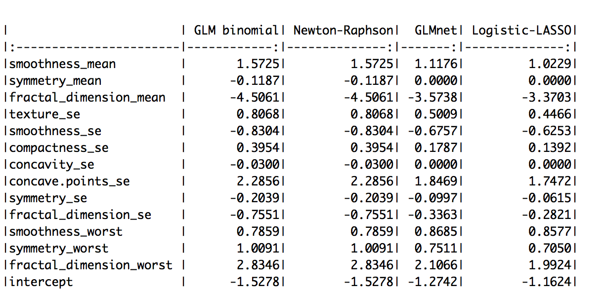

```{r setup, include=FALSE}
knitr::opts_chunk$set(echo = TRUE)
```

## Objective

Breast cancer is one of the most common cancers in women. However, early diagnoses of breast cancer can aid in reducing the mortatlity rate. Additionally, advances in imaging technologies and statistical methodologies have allowed for higher-quality data and novel models that could improve the precision of breast cancer diagnoses. The purpose of our project is to build and compare different models in classifying breast cancer tumor as benignant or malignant based on image-based predictors. Specifically, we are look to build a logistic regression model using Newton Raphson method, as a regularized logistic-LASSO usisng coordinate-wise optimization algorithm. 

### Dataset

There were 569 images collected independently from different patients, 212 of whom had malignant tumor and 357 were benign cases. The images were broken down into 30 predictors, corresponding to the mean, standard deviation, and largest values (points on the tails) of the following 10 features:

\begin{itemize}
\item radius (mean of distances from center to points on the perimeter)
\item texture (standard deviation of gray-scale values)
\item perimeter
\item area
\item smoothness (local variation in radius lengths)
\item compactness (perimeter\^ 2 / area - 1.0)
\item concavity (severity of concave portions of the contour)
\item concave points (number of concave portions of the contour)
\item symmetry
\item fractal dimension ("coastline approximation" - 1)
\end{itemize}


### Data cleaning 

As shown in the pairwise correlation plot (\textbf{Fig. 1}), we can observe the presence of some multicollinearity among the predictors. For instance, the radius_mean variable has almost perfect correlation of 1 and 0.99 with perimeter_mean and area_mean variables, respectively. We then left out variables that are correlated by more than 85% with other predictors. The final dataset contained 13 predictors. 

Next, considering the LASSO is not scale-invariant, we standardized the design matrix. This is to ensure comparability of estimates by the logistic-LASSO model and Newton-Raphson/logistic regression model. The standardization formula is as follows:

$standardized(x_{ij}) = \frac{x_{ij} - \bar{x_{j}}}{std(x_{j})}$ for $i = 1,2,...30$ and $j = 1,2,..., 569$

Finally, we recoded response variable such that "malignancy" = 1, and "benign" = 0.

#### Newton-Raphson model

We used logistic regression to classify the malignancy of tissue. Malignancy corresponds to response variable being 1 ($y^{(i)} = 1$).

Log likelihood is
$$l(y;\beta) = \sum^n_{i = 1} \{y_{(i)} log\mu_{(i)} + (1 - y_{(i)}) log(1 - \mu_{(i)})\}$$

Its gradient is given by
$$g: \bigtriangledown l(y;\beta) = \sum^n_{i = 1} (y_{(i)} - \mu_{(i)}) x_{(i)} = X^T(y - \mu)$$

Its Hessian matrix is given by
$$H: \bigtriangledown^2 l(y;\beta) = -\sum^n_{i = 1} \mu_{(i)} (1 - \mu_{(i)}) x_{(i)} (x_{(i)})^T = -X^TSX$$
where $S = diag(\mu_{(i)} (1 - \mu_{(i)}))$, and
$$\mu_{(i)} = p_{\theta}(y = 1|x) = \frac{e^{X_{i}\beta}}{1+e^{X_{i}\beta}}$$

Since we have several predictors, we want to optimize several likehood functions simultaneously. This is equivalent to solving a system of log-likelihood equations $\bigtriangledown l(y;\beta_{j}) = 0$ where $j = 1,2,...13$. To achieve this, we use the Newton Raphson algorithm.  

#### Newton-Raphson Algorithm 

Starting at a current point $\beta_{i}$, we can expand the log-likelihood function around this point using Taylor's expansion, which gives a neighborhood of $\beta_{i}$ containing $\beta_{i+1}$ which increases the likelihood. The equation below can be used to iteratively update $\beta_{i}$ until the sequence converges and $\bigtriangledown l(y;\beta_{j}) = 0$ is satisfied:

 $\beta_{i+1} = \beta_{i}- [\bigtriangledown^2 l(\beta_{i})]^{-1} \bigtriangledown l(\beta_{i})$.

However, when implementing the algorithm, we need to check at every step, that the updating direction (for $\beta_{i+1}$) is heading to a maximum, and that the point is moving sufficient distances towards the maximum so we do not miss it. Therefore, we also implemented some modifications, including gradient descent and step-halving. 

* For step-halving, we modified the updating function for $\beta_{i+1}$ as follows:

$\beta_{i+1} = \beta_{i}-\lambda [\bigtriangledown^2 l(y;\beta_{i})]^{-1} \bigtriangledown l(y;\beta_{i})$, where $\lambda = 1$ until $l(\beta_{i+1}) \leq l(\beta_{i})$, which means the new point would have gone too far. Then, we can search for a value $\lambda$ such that $l(\beta_{i+1}, \lambda) \geq l(\beta_{i})$. At this step, we can cut the step, or $\lambda$ in half for each sub-iteration.

* For gradient descent, at every iteration, we checked whether $\bigtriangledown^2 l(y;\beta)$ is negative definite (signifying the point is moving in the right direction). If $\bigtriangledown^2 l(y;\beta)$ is not, we replace it with a similar negative definite matrix, such as $\bigtriangledown^2 l(y;\beta) - \gamma I$ where $\gamma$ is chosen such that the resulting matrix is negative definite. Naturally, this $\gamma$ must be greater than any of the elements of the diagonal matrix $D$ obtained by eigendecomposing $\bigtriangledown^2 l(y;\beta) = P^{T}DP$.

### Logistic-LASSO model

The LASSO is a high-dimensional method to handle high-dimensional data, which adds a penalty term to the loss function of a regular linear regression model. In linear regression, the LASSO minimizes: 

$f(\beta) = \frac{1}{2n}\Sigma^n_{i=1}w_{i}(y_{i}-\Sigma^p_{j=1}x_{i,j}\beta_{j})^2 + \lambda \Sigma^p_{j=1}|\beta_{j}|$ for some $\lambda \geq 0$ 

where $w_{i}$ is the working weights, defined as $p(1-p)$ (p is the probability of event for each observation).

Coordinate-wise Descent algorithm is used to minimize this objective function. Each $\beta_{i}$ is optimized using this equation:

$\tilde\beta_{i} = \frac{S(\Sigma_{i}w_{i}x_{i,j}(y_{i}-\tilde{y}^{(-j)}_{i}),\lambda)}{\Sigma_{i}w_{i}x_{i,j}^2}$

where $S(\hat\beta, \gamma)$ is called soft-threshold and is defined as 


...

## Results

The coefficient estimates can be found in (\textbf{Fig. 5}). Newton-Raphson algorithm gives quite similar estimates to those in the logistic regression model produced by GLM package. For the logistic-LASSO model, we can see the coefficient estimates are approximately close to the ones produced by GLMnet with 5-fold cross-validation. They do not exactly match, however, due to the potential dissimilarities in set-up conditions in our implementation and theirs.

The path of solution could be found in (\textbf{Fig. 2}), and the distribution of cross-validated MSEs produced by the hand-built logistic-LASSO model could be found in (\textbf{Fig. 3}). Five-fold cross-validation suggested the best $\lambda$ is 0.00454, which corresponds to the lowest cross-validated MSE. A similar distribution of cross-validated MSEs produced by the GLMNet package in R can be found in (\textbf{Fig. 4}). Here, 5-fold cross-validation suggested the best $\lambda$ is 0.0037. 

Lastly, we wanted to compare the prediction performance using MSE as a criteria. We examined this undertwo scenarios, one is with 5-fold cross-validation, and the other is 5-fold repeated cross-validation (number of repeats is 5). These distributions can be found in Figure 3 and 4, respectively. We noticed that the cross-validated MSE of both Newton Raphson and logistic-LASSO are similary distributed, although the latter seems to perform slightly less well. On the other hand, GLMnet gives the most consistently well performance under both scenarios. Nonetheless, the errors were all in close and acceptable proximity with one another so we are confident they all very good discriminatory power. 

### Conclusions 

The report aimed to explore how different models perform at the same task of classifying breast cancer tumors into benign and malignant types using various predictors derived from the tumor images. Since we have eliminated most multicollinearity at the beginning, it is reasonable to expect Newton-Raphson and logistic-LASSO to have quite similar discriminatory performance. On the other hand, we would expect to see logistic-LASSO to perform better than Newton Raphson in terms of predictive ability in the presence of higher-dimensional data, and with more correlated predictors. We will aim to explore this further as more time and bandwidth allow. All in all, these models we looked at in this report nevertheless perform decently in classifying correctly each type of breast cancer.

\clearpage

## Appendix

### Figure

```{r , echo=FALSE, fig.cap="Multicollinearity plot of the dataset", out.width='80%', fig.pos='h', fig.align = "center"}
knitr::include_graphics("plot1.pdf")
```

```{r , echo=FALSE, fig.cap="The path of solution", out.width='70%', fig.pos='h', fig.align = "center"}
knitr::include_graphics("plot2.pdf")
```

```{r , echo=FALSE, fig.cap="Plot of cross-validated MSEs by hand-built model", out.width='80%', fig.pos='h', fig.align = "center"}
knitr::include_graphics("plot3.pdf")
```

```{r , echo=FALSE, fig.cap="Plot of cross-validated MSEs by the GLMNet", out.width='60%', fig.pos='h', fig.align = "center"}
knitr::include_graphics("plot4.pdf")
```

```{r , echo=FALSE, fig.cap="The coefficient estimates of each model", out.width='80%', fig.pos='h', fig.align = "center"}

```


